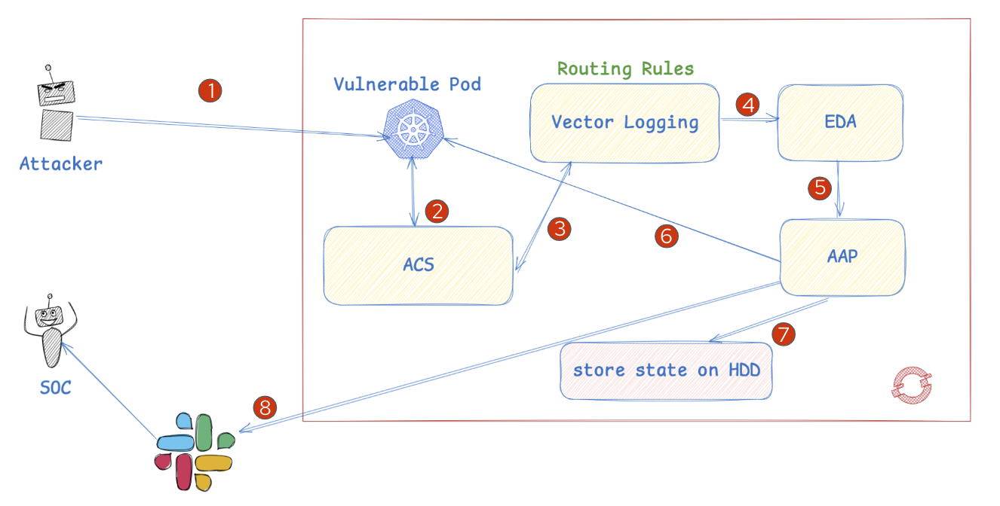
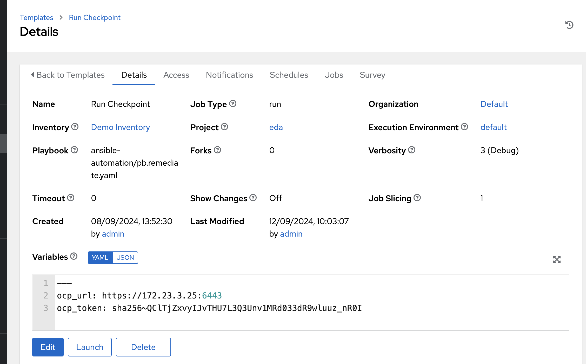
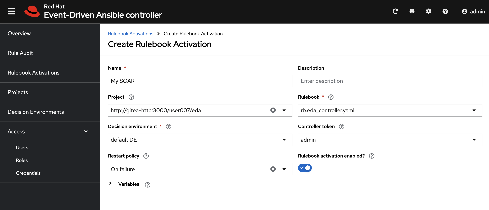
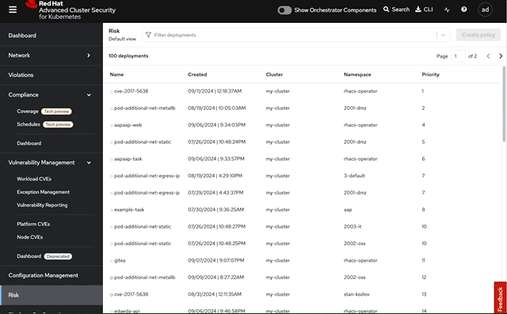
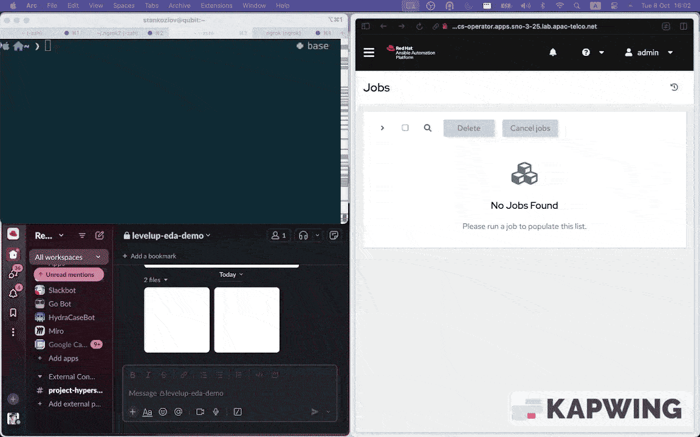

# Objective

This repo demonstrates Ansible Event Driven Automation (EDA) capabilities for SOAR (Security Orchestration Automation Remediation).

## Use Case

Each organization has its own approach to hunting and resolving vulnerabilities, advanced persistent threats (APT), and malicious activities. One of the key aspects of this process is conducting forensic analysis. This techniques is well adopted for VMs, but it also recently came to the containers and [kubernetes](https://kubernetes.io/blog/2022/12/05/forensic-container-checkpointing-alpha/>). The checkpoints allows to:

**Preserving Evidence:** preserve the exact state of a container at the time of an incident, ensuring that the evidence of a potential attack is not lost.

**Post-Incident Analysis:** analyze forensically to identify security threats, such as malware, unauthorized access, or data breaches, after an incident occurs.

**Minimal Downtime:** capturing the state of a running container without stopping the application for an extended period, making it ideal for environments where uptime is critical

**Restoring and Reproducing:** restore from a checkpoint to recreate the exact environment at the time of the capture

## Flow and details

The OpenShift cluster hosts three key applications within a single namespace: Red Hat Ansible Automation Platform (AAP), Ansible Event Driven Automation (EDA), and Red Hat Advanced Cluster Security (ACS). These applications are configured with a container baseline process security profile. The baseline policy monitors processes, and any deviation from the approved process ID triggers an alert. There is also a test application deployed in the namespace, which we will be working with to run a process outside the baseline.

When ACS detects a process that is not part of the baseline(2), it sends a notification to the upstream log aggregator(3), represented by Vector. Vector filters these events based on the policy name and trigger Ansible EDA instance via a webhook for remediation(4). Events that do not match the policy are streamed to Vector's STDOUT. Upon receiving the notification with all important details from ACS (cluster name, namespace, container name, etc.), the Ansible EDA instance triggers an Ansible Automation Platform template(5) to create a container checkpoint (snapshot)(6,7). This snapshot is then available for further analysis by the security teams, who are notified via Slack (8).

The use case can be easily enhanced with additional actions, such as placing the container in a jailbox/kata environment to isolate it from other workloads using lightweight virtualization, or applying additional network policies to restrict the communication of the violated container.

## Prerequisites

1. OpenShift 4.14+
2. Ansible Automation Controller deployed on OpenShift via operator
3. Event Driven Automation Controller deployed on OpenShift via operator
4. Enabled CRIU extensions for CRIO to be able create snapshots (this repo has Machine Config for it, please be noted that applying them will trigger rolling restart of the nodes, therefore they are commented out in kustomize file) See this KB for more details [https://access.redhat.com/solutions/7008477]

`Note: For the simplicity all resources are deployed in rhacs-operator namespace`

## Installation and configuration

### AAP Configuration

Create AAP project from GitHub repository and template

Populate variables into the template:

`ocp_url:` OpenShift API URL or IP

`ocp_token:` OpenShift Service account token with Admin privileges

### EDA Configuration

Create EDA Project from GitHub repository and run rulebook

Get kubernetes service name to be used for the Vector Webhook

Update `base/vector-config.yaml` with EDA kubernetes service name and port

### Application deployment

Install vulnerable application and logging stack
`oc apply -k .`

See this article for more details on how to setup EDA + AAP [https://medium.com/@julialiu08/writing-ansible-rulebooks-with-event-driven-ansible-69c17d3d7657]

### ACS Configuration

Configure ACS to monitor baseline process of new deployment

## Testing the policy

Run remote shell on the target container `oc rsh and see playbook execution (in my case also a SLACK notification)

## Additional resource

#### JQ Queries [jmespath] playground

`ALERT` https://play.jmespath.org/?u=c6c4e1cc-bf08-438c-aaf2-8dd05ef40bec

`POD` https://play.jmespath.org/?u=b92ffc73-8f3a-49e3-ada2-0f43e3f795f1

#### Vector VRL Playground

`VRL` is Vector Remapping Language, see how ACS payload mapped to EDA -> https://tinyurl.com/4sneu5sv
